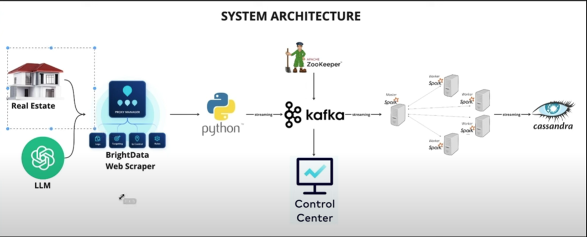

# Real Estate DataEngineering project using AI
## System Architecture

This project is a real estate data pipeline that scrapes property information from a real estate website, processes it, and stores it in a Cassandra database using Apache Spark and Kafka.

## Features

- Scrapes property information from a real estate website using Playwright and BeautifulSoup.
- Processes scraped data and extracts relevant details using OpenAI's GPT-3.
- Stores processed data in a Kafka topic.
- Consumes data from Kafka and inserts it into a Cassandra database using Apache Spark Structured Streaming.

## Requirements

- Python 3.7 or higher
- Playwright
- BeautifulSoup
- OpenAI
- Kafka
- Apache Spark
- Cassandra
## Installation

1. Clone the repository:

   ```bash
   git clone https://github.com/munna710/RealEstateDataEngineering.git
2. Install dependencies:

   ```bash
   pip install -r requirements.txt
## Usage

1. Start Kafka and Cassandra services:
   ```bash
     # Start Kafka
     bin/kafka-server-start.sh config/server.properties

    # Start Cassandra
    bin/cassandra -f
2. Run the producer script (main.py) to scrape data and publish it to Kafka:

   ```bash
   python main.py
3. Run the consumer script (spark-consumer.py) to consume data from Kafka and insert it into Cassandra:
   ```bash
   python spark-consumer.py
   
## Configuration

- Kafka broker address: Update localhost:9092 in main.py and spark-consumer.py if your Kafka broker is running on a different host or port.
- Kafka topic name: Update "real-estate" in spark-consumer.py to match the topic name used by the producer script.
- Cassandra host: Update 127.0.0.1 in spark-consumer.py to connect to the Cassandra instance running on a different host.
- Keyspace and table: Update the keyspace (real_estate) and table (property) names in spark-consumer.py if you use different names.
